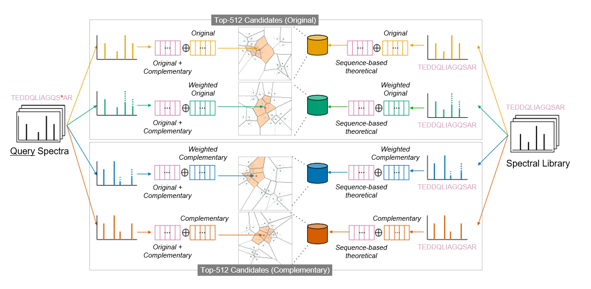
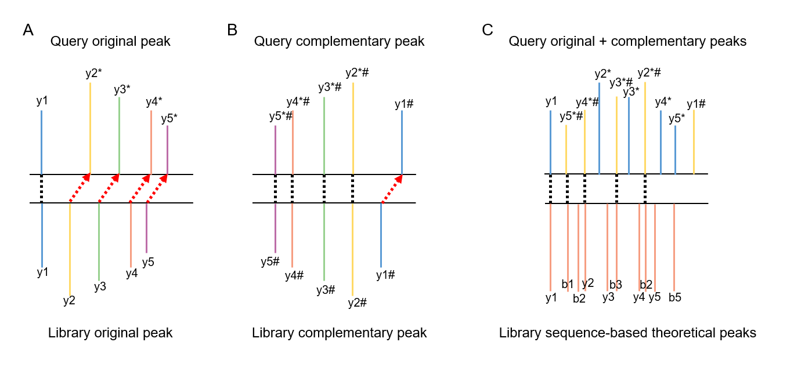

# POMS


*Figure 1. Overview of the POMS framework. Overall workflow integrating complementary spectral representations and sequence-derived theoretical fragment features for efficient and comprehensive candidate retrieval.*

**POMS** (**P**osition aware **O**pen **M**odification **S**earch) is a spectral library search engine for fast and accurate open modification searching, adapted from the ANN-SoLo codebase for advanced spectral analysis. POMS uses approximate nearest neighbor indexing to speed up open modification searching by quickly selecting only the most relevant library spectra to compare against an unknown query spectrum.

## Core Methodology: Modification-Aware Spectral Representation

Unlike traditional open search tools that struggle with mass-shifted peaks, POMS employs a novel dual-embedding strategy. 


*Figure 2. Modification-aware spectral representations and the dual-embedding strategy. (A) Query original peak vs. Library original peak. (B) Illustration of complementary spectrum generation, aligning modification-shifted peaks. (C) Conceptual illustration of the dual-embedding strategy, combining both original and complementary peaks compared against sequence-derived theoretical peaks.*

By generating complementary spectral representations and matching them concurrently across 4 distinct vector spaces, POMS successfully preserves local fragmentation patterns and captures global peptide backbone similarity, effectively resolving the mass-shift alignment problem.

## Requirements and Installation

POMS requires **Python 3.7+**. The algorithms leverage rapid similarity indexes utilizing FAISS. The GPU-powered version is recommended for systems with NVIDIA CUDA support, while the CPU-only version is a great fallback for general use.

### Installation

1. Clone this repository and navigate to the project root directory.
2. Install the prerequisites via `requirements.txt`:
   ```bash
   pip install -r requirements.txt
   ```
   *Note: if you intend to run this on a GPU, remove `faiss-cpu` and install `faiss-gpu` instead:*
   ```bash
   pip uninstall faiss-cpu
   pip install faiss-gpu
   ```

## Running POMS

POMS is a spectral library search engine, so you need the following two files:

* A spectral library in the `.splib` format (for example, generated by [SpectraST](http://tools.proteomecenter.org/wiki/index.php?title=Software:SpectraST)).
* The query spectra to be identified in the `.mgf` format.

You can execute POMS by invoking the main module. It accepts the input files mentioned above and outputs the identification results to an `.mzTab` file.

### Command-line Syntax

```bash
python -m poms.poms spectral_library.splib query_file.mgf output_file.mztab [OPTIONS]
```

### Essential Search Parameters

We strongly recommend providing the fundamental mass tolerance settings to ensure accurate identifications:

- `--precursor_tolerance_mass` (float, required): Precursor mass tolerance for the initial narrow-window search.
- `--precursor_tolerance_mode` (string, required): Unit for the precursor tolerance. Options: `Da` or `ppm`.
- `--fragment_mz_tolerance` (float, required): Mass tolerance for comparing fragment peaks (in m/z).
- `--precursor_tolerance_mass_open` (float, optional): Precursor mass tolerance for the open modification cascade search level.
- `--precursor_tolerance_mode_open` (string, optional): Unit for the open search precursor tolerance (`Da` or `ppm`).

### Example Usage

Below is a typical example to search an MGF file against a spectral library, using a narrow tolerance of 20 ppm and allowing peak shifts using an open tolerance of 500 Da:

```bash
python -m poms.poms \
  ../data/library.splib \
  ../data/query.mgf \
  ../output/results.mztab \
  --precursor_tolerance_mass 20 \
  --precursor_tolerance_mode ppm \
  --fragment_mz_tolerance 0.05 \
  --precursor_tolerance_mass_open 500 \
  --precursor_tolerance_mode_open Da \
  --allow_peak_shifts \
  --fdr 0.01 \
  --mode ann
```

> **Tip:** You can optionally define parameters in a `config.ini` file in your working directory rather than writing long queries into your command line terminal. You can point the program to it using `-c config.ini`.

### Advanced Options and FAISS tuning

- `--mode {ann,bf}`: Choose between Approximate Nearest Neighbors (`ann`) or brute-force exact matching (`bf`). `ann` is the default and is heavily recommended for performance.
- `--bin_size`: Vector bin size for indexing (default `0.04` Da).
- `--num_candidates`: Number of matched candidates retrieved per index query (default `1024`).
- `--no_gpu`: Disables the GPU indexing explicitly and forces the fallback to CPU computation strings.

## Visualization

You can visualize any spectrum-spectrum matches identified inside the output mztab natively using `plot_ssm`:

```bash
python -m poms.plot_ssm ../output/results.mztab <query_id>
```

This commands will extract and generate `.png` plots overlaying the candidate spectra for verification.

## License

This software codebase is made available as open-source. For prior heritage modifications, see the parent node [ANN-SoLo](https://github.com/bittremieux/ANN-SoLo).
